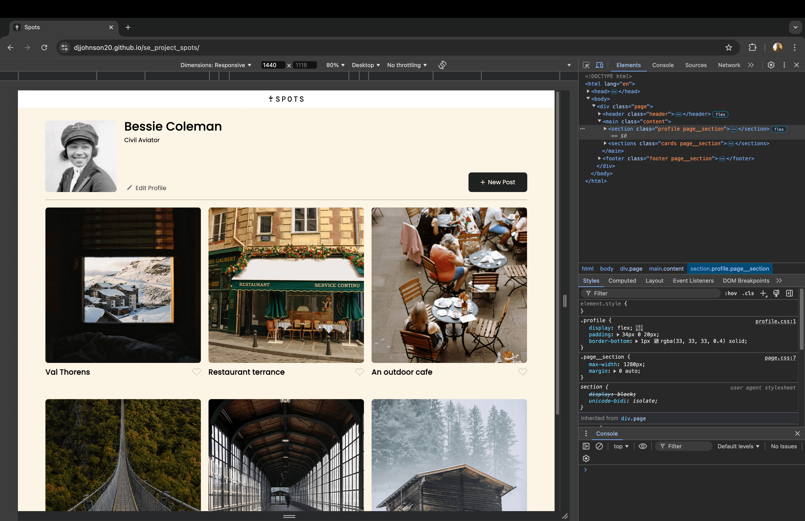
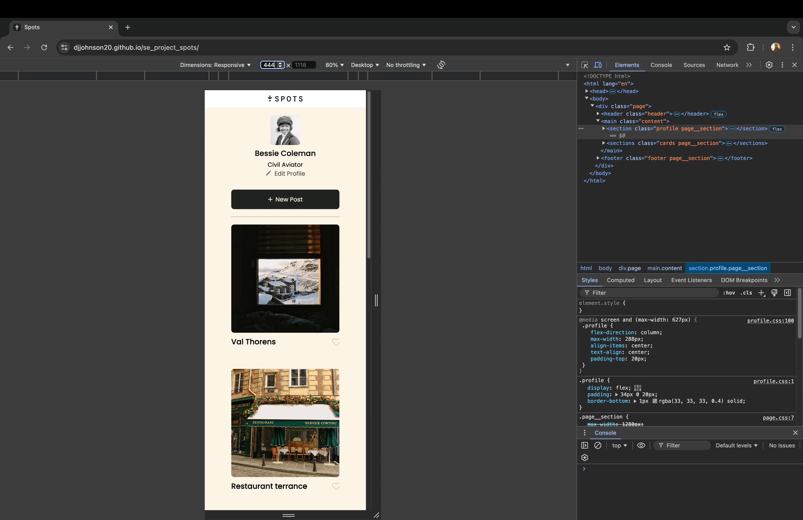

# Spots

An image sharing site.

## Description

A webpage that allows users to share their photos with captions for the world. Functions inlcudes a like button, a edit profile button, and a button to add a new post.

## Tech Stack

- HTML
- CSS
- Responsive Design

## Screenshots of Project

- Project in Desktop View

- Project in Tablet View

- Project in Mobile View

## Deployment

This webpage is deployed to GitHub Pages

- [Deployment Link](https://djjohnson20.github.io/se_project_spots/)
